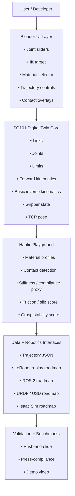

# SO101 Haptic Digital Twin
A Blender-native digital twin and haptic material playground for the LeRobot SO101 arm.

## Vision
The SO101 Haptic Digital Twin is a Blender-native robotics playground that turns the Hugging Face LeRobot SO101 arm into an interactive, material-aware digital twin for learning, debugging, and demonstrating manipulation. It allows developers to control the arm through joints, IK targets, and trajectory replay while visualising contact, friction, compliance, slip, deformation proxies, and grasp stability across different material profiles. The project is designed as a lightweight bridge between accessible robotics education and simulation-first Physical AI workflows, with a roadmap toward LeRobot policy replay, ROS 2, URDF/USD export, and higher-fidelity Isaac Sim-style digital twin environments.

*Mockup image designed in Blender, used ChatGPT for post-processing the render before manual annotation* 

## Why this exists
- LeRobot makes real-world robotics more accessible.
- There is still a need for intuitive tools for understanding contact, materials, and manipulation failure.
- This project aims to visualise robot motion, contact, friction, compliance, and grasp stability in one lightweight playground.

## Demo
- Aim to have the following: 1. Join Control, 2. Trajectory Replay, 3. Material Comparison, 4. Contact 

## Deisrable Features
- SO101 link/joint model
- FK and basic IK
- Trajectory playback
- Haptic material profiles
- Contact and slip proxy
- Grasp stability scoring
- Benchmark scenes

## Technical Architecture

## Limitations
- Not a high-fidelity physics simulator
- Haptic signals are proxies
- No real force-feedback device yet
- Blender physics has limitations

## Contributing
Good first issues.

## Acknowledgements
Hugging Face LeRobot, SO-ARM ecosystem, Blender, robotics simulation community.